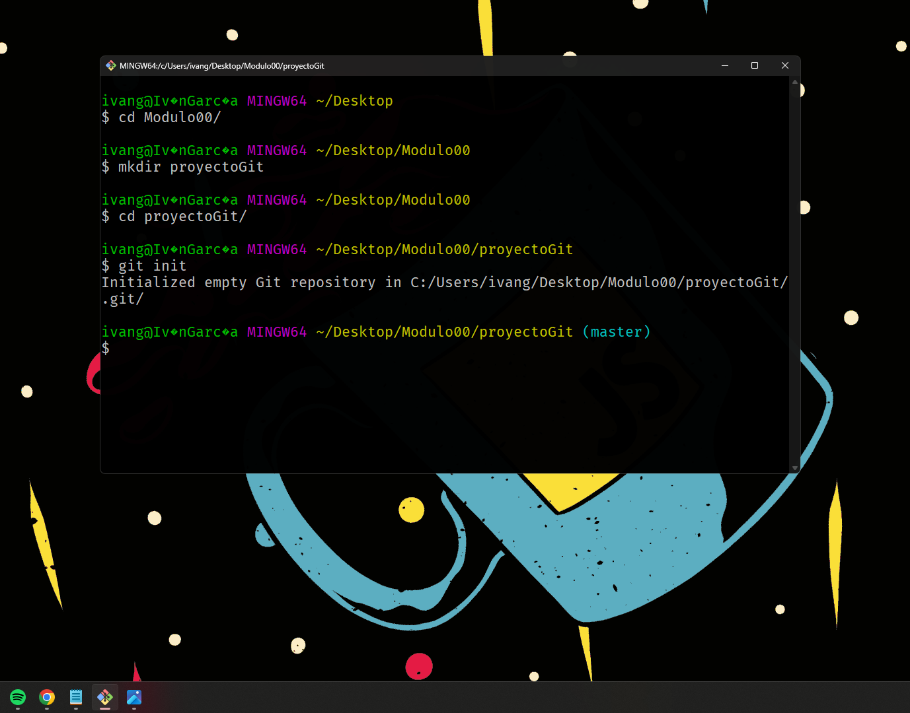

# LABORATORIO BOOOTCAMP JS MODULO 00

## PASO 1:

Me he movido al directorio donde voy a realizar el proyecto, he creado una carpeta desde terminal y he inicializado git.

## PASO 2:

He creado un repositorio en mi cuenta de github, además he conectado mi repositorio local al remoto, y he verificado la conexión con el comando "git remote -v".

## PASO 3:

He añadido un archivo, lo he añadido al staging con el comando "git add ." y he realizado su respectivo commit. Además, he creado una nueva rama llamada "development", con sus respectivas modificaciones. Todo subido al repositorio.

## ULTIMO PASO:

He realizado su respectivo merge, he revisado que no existan conflictos y lo he subido al repositorio remoto.

